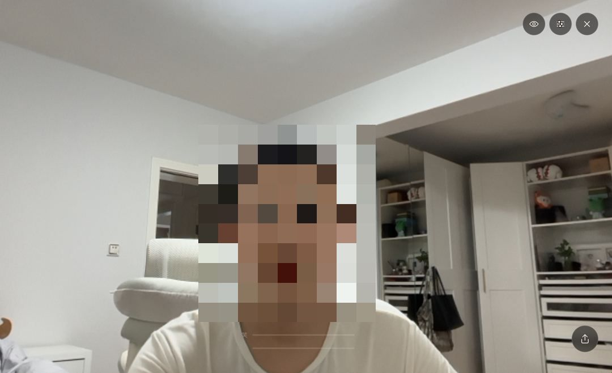
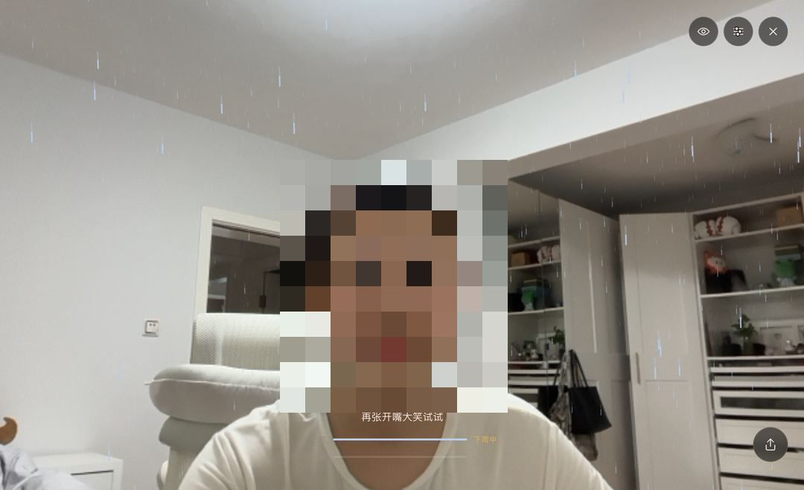
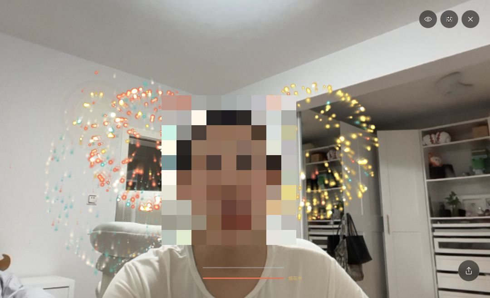
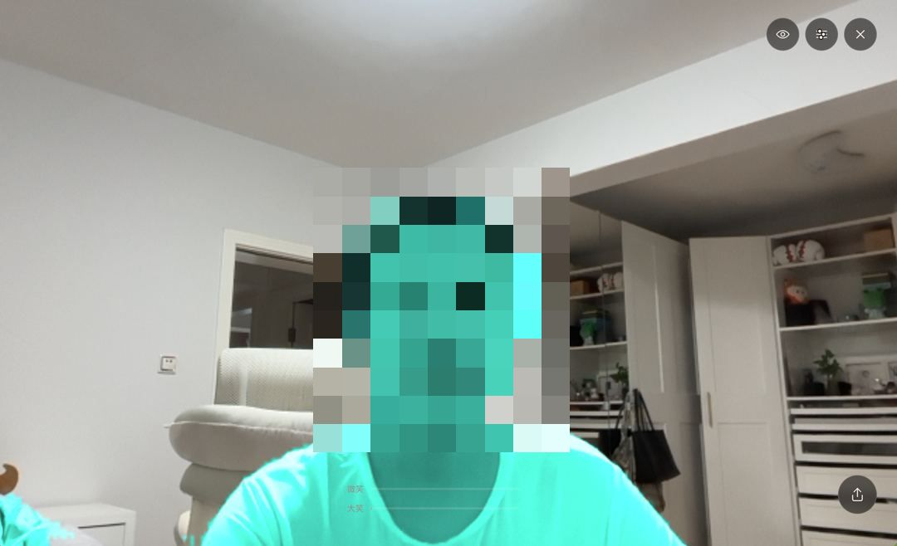

# 笑雨烟花 · Smile Rain & Fireworks

浏览器端 AR 表情互动原型：**微笑时全屏三层景深下雨；大笑时烟花从画面底部升空、在高处炸开，
粒子落到头上会弹开、闪白。**
纯前端、无服务端；检测和渲染都在浏览器里完成，没有服务端推理费用。PC 与手机浏览器直接打开。

**[Live Demo → smile.kkyq.hk.cn](https://smile.kkyq.hk.cn)**（国内直连；备用地址 [smile-rain-fireworks.vercel.app](https://smile-rain-fireworks.vercel.app)，若开启 Vercel 部署保护则需登录，真机请用自定义域名）

| 待机 | 微笑 · 下雨 | 大笑 · 烟花撞头 | 打开「显示碰撞体」 |
| --- | --- | --- | --- |
|  |  |  |  |

截图中的人脸已打码；评审设备打不开摄像头时，右下角圆钮点一下下雨、长按放烟花。

**交付清单**

| 验收项 | 位置 |
| --- | --- |
| 1. Live Demo | [smile.kkyq.hk.cn](https://smile.kkyq.hk.cn)（备用 [vercel.app](https://smile-rain-fireworks.vercel.app)） |
| 2. Source Code | 本仓库，Public；核心代码在 `src/`，AI 协作过程资料在 `process/` |
| 3. Vibecoding 复盘 | [本页末尾](#vibecoding-复盘200-字以内)，完整记录 `docs/vibe-log.md` |

---

## 我如何理解这个需求

PM 的原话只有三句：微笑下雨、大笑烟花、粒子撞头。要做成产品，先得把它翻译成**可测量、可验收**的定义。

放到直播间的语境里，这三句话其实是礼物特效的缩影：微笑触发的小雨对应低档礼物的轻量氛围特效，大笑触发的全屏烟花对应高档礼物的全屏大动画——**表情强度分层 = 礼物价值分层**。所以下面的设计里，雨量和烟花规模都跟着表情强度连续变化，而不是两个开关。

### 什么是「微笑」，什么是「大笑」

MediaPipe Face Landmarker 每帧输出 52 个表情系数（0–1）。取
`smile = (mouthSmileLeft + mouthSmileRight) / 2` 与 `jawOpen`，用一个**三态状态机**区分。
退出阈值由进入阈值派生：微笑退出 = `smileEnter × 0.7`，大笑退出 = `laughJaw × 0.6`。
默认 `smileEnter = 0.30`、`laughJaw = 0.15`（`src/config.ts` / `public/effect.json`）。

| 转移 | 条件 |
| --- | --- |
| Idle → Smiling | smile ≥ `smileEnter`（默认 0.30）持续 600 ms |
| Smiling → Idle | smile < 微笑退出（默认 0.21）持续 500 ms |
| Idle / Smiling → Laughing | jawOpen ≥ `laughJaw`（默认 0.15）且 smile ≥ 微笑退出，持续 150 ms |
| Laughing → Idle | jawOpen < 大笑退出（默认 0.09）持续 400 ms |
| 任意 → Idle | 无脸持续 1 s |

Idle 可以直接进 Laughing，不必先经过微笑。嘴在张开（jawOpen 已达 `laughJaw` 的 60%）时，微笑进入计时最多暂停 400 ms，避免「突然大笑」先变成下雨。

界面上的微笑条画的是幅度 `smileAmp = clamp(smile / smileEnter, 0, 1)`，随当前笑容涨落。
600 ms 候选计时在 `smileProgress` / `tSmileEnter` 里，只供状态机判断是否进入 Smiling，**不驱动这条幅度条**。
大笑条画的是 `laughProgress`：未进入 Laughing 时，取「张嘴幅度 / 大笑灵敏度」和「微笑信号 / (微笑进入阈值 × 0.7)」里较小的那个，最大为满格；进入 Laughing 后保持满格。这是当前信号的显示比例，不含 150 ms 持续时长。

三个设计决策：

- **进入阈值高于退出阈值**（迟滞）。否则用户笑到临界值时，雨会反复开关。
- **每条转移都要求持续时长**（防抖）。一帧误检不该炸出一发烟花。
- **「爆发」不是状态，是 Laughing 内部的事件。** 把爆发做成状态，就要处理
  「爆发动画播到一半嘴合上了该去哪」，状态管理和中断处理都会更复杂。做成事件则：
  进入 Laughing 即齐发 → 之后每 0.9 s 大烟花、间隙每 0.4 s 补一枚小的。

### 状态管切换，信号管强度

状态机只决定「现在是哪个模式」，**效果强度由连续信号驱动**：
雨量 = `smoothstep(微笑退出, 0.80, smile)`，烟花粒子数随 `jawOpen` 缩放。
所以浅笑到大笑之间雨是平滑变浓的，而不是几个档位跳变。
雨与烟花互斥：Laughing 期间雨量目标为 0，约 0.4 s 切出。

离开 Laughing 后还有 1.5 s 的**情绪残留**——烟花逐渐稀疏而不是硬停，像笑完之后还有余韵。

### 「头部」是什么形状

用 face oval 整圈 **36 个轮廓点**做 PCA，拟合出一个**带滚转角的椭圆**。
椭圆路径上，每颗粒子做一次局部坐标几何判定，不必把整张脸做成多边形；但有两件事必须处理，否则「碰撞」只是看起来像碰撞：

**椭圆必须跟着头转。** 第一版是轴对齐的，人一歪头，脸转了椭圆没转，判定整个偏掉。
现在由 PCA 的主特征向量给出头部长轴，碰撞在头部自己的坐标系里完成，法线算完再旋转回世界坐标。

**不能只用 4 个点。** 单个 landmark 每帧都在抖，用它定中心和朝向，抖动会直接进碰撞体——
这是「碰撞范围很不固定」的另一半原因。整圈 36 点求出来的中心、主轴、尺寸把独立抖动平均掉了。

**几何拟合再准也会抖，所以还要做时域处理。** 固定系数平滑里，强平滑降低抖动但增加滞后，弱平滑响应快但更易抖动，很难同时照顾静止和甩头。
这里用 **One Euro 滤波器**（Casiez et al. 2012）——截止频率跟着速度自适应，
静止时滤得重、快速运动时延迟低，而且只滤中心/半轴/角度这 5 个派生标量，不滤 72 个原始坐标。

**「脸」不等于「头」。** MediaPipe 的关键点最高只到额头，
**颅顶的骨头和头发根本不在关键点里**——第一版的粒子会穿过头发才碰到额头，
这正是它「看起来不准」的原因。现在沿头部朝上方向按 oval 半高的 30% 外扩（`SKULL_EXTEND = 0.3`），再乘 2% 安全裕度。

把 36 点直接做成多边形碰撞体也被考虑过，但它描的同样是「脸」的边界，一样盖不住头发，
每颗粒子的判定成本还更高。所以这里的取舍是**用 36 点求出稳定的朝向与尺寸，再落到一个可以向上外扩的椭圆上**。

这段几何和滤波都是「看起来对、但眼睛很难量」的数学，所以配了一个数值验证脚本
（`npm run verify:head`）：用合成的歪脸检查角度还原误差、椭圆的包围性、以及滤波指标。
它当场抓到一个目测发现不了的问题——只外扩顶部并上移中心，椭圆会在**下侧翼**收进轮廓内约 0.3%，
于是补了一个 2% 的安全裕度。

| 验证项 | 脚本记录 |
| --- | --- |
| 头部朝向还原（±60°） | 无噪声时约 0°；带点噪声时最大约 0.5°（脚本通过门槛 2.5°） |
| 椭圆包围整圈轮廓 | 加安全裕度后脚本通过 |
| One Euro 静止去抖 | 输出逐帧变化约为输入的 22%，即降至原来的约 22% |
| One Euro 运动滞后 | 400 px/s 匀速时约 17 ms |

上表为 2026-09-16 最近一次运行的读数（去抖含随机噪声，逐次略有浮动：约 21–23%、滞后约 17 ms、角度误差 < 0.5°）。脚本通过不能代替真机验收。

### 碰撞用什么，反馈是什么

两条路径不要混成同一种「解析碰撞」：

- **椭圆模式**（分割关闭、低档关掉、或 Worker 未给出可用遮罩）：烟花粒子相对带滚转角的椭圆做几何判定。
- **遮罩模式**（中/高档、开关打开、且 Worker 已出遮罩）：烟花粒子在分割结果上做固定次数的像素查表；雨画在 `#rain`、人像画在其前的 `#camFront` 上，看起来雨落在身后。

每颗粒子的采样次数是固定的，粒子遍历成本随粒子数近似线性增长。分割推理和遮罩图更新按自己的间隔另计，不折进这趟遍历。
「显示碰撞体」画的是**当前这条路径**：遮罩模式是分割结果，椭圆模式是头部椭圆。

| 类型 | 当前反馈 |
| --- | --- |
| 雨 | **不参与碰撞**，继续下落 |
| 烟花粒子撞头 / 撞人 | 沿法线弹开 + 闪白 50 ms + 略缩小；碰撞体边缘可有约 120 ms 微光脉冲 |

两个被推翻的早期做法，写在这里因为取舍本身就是答案：

**雨不该被头「吃掉」。** 历史方案让雨滴撞到椭圆就消失，物理上没错——头确实会挡雨——
但画面上脸的位置出现一个硬边的圆形空洞，非常假。其后还试过头顶溅水花，**已从当前实现拿掉**。
现在雨不参与碰撞；人像分割开启时，互动主要来自雨落在人身后，以及烟花撞人。

**烟花不该从嘴里喷。** 历史方案从嘴部炸开，动作方向是「往外喷」，和烟花的语义相反。
现在从画面底部升空、到顶点炸开、粒子受重力落到人身上——
上升那一小段等待正是烟花的仪式感，也让「粒子落到头上」这件事自然发生。
历史方案还试过撞头分裂成更小火星；余辉层上太抢戏，**当前实现是弹开、闪白、缩小，不再分裂**。

---

## 架构

```
camera.ts → face.ts(信号总线) → state.ts(状态机) → particles.ts(发射器 + 碰撞) → canvas
                                      ↑                        ↑
                              EffectConfig（阈值 / 粒子 / 配色）
```

模块按「信号 → 规则 → 发射器」分开，新增玩法时通常只需加信号、规则或发射器，改动范围较小，但不是「只加一项、旧模块永不改」。
转头控制烟花还需要头部姿态信号和方向映射；新的表情特效仍然要写规则和发射器。

屏幕分层：`<video#cam>` 镜头 → `<canvas#rain>` 雨 → `<video#camFront>` 分割抠出的人（未开启时隐藏）→ `<canvas#fx>` 烟花 → HUD（DOM）→ 调参抽屉。

---

## 技术选型与取舍

下面是**这个场景**里的取舍，不是对所有项目都成立的结论。

| 决策 | 理由 |
| --- | --- |
| MediaPipe Face Landmarker，不用 face-api.js | 后者常见输出是情绪分类分数，并不直接对应本项目所需的 `mouthSmileLeft/Right`、`jawOpen` 这类动作系数 |
| Canvas 2D，不用 Three.js / PixiJS | 本场景粒子量在千级，用 2D 足够画完；少一层抽象就少一层出错面 |
| **不引入任何物理引擎** | 椭圆路径是几何判定，遮罩路径是像素查表；每颗粒子采样次数固定时，遍历成本随粒子数近似线性。给每颗粒子建刚体对这里是过度工程 |
| 检测降频约 20 Hz，**碰撞与渲染每帧** | 降频的是检测。碰撞若跟着降频，穿模会更容易出现；每帧碰撞降低这一风险，但不保证粒子永不穿透 |
| 发光用预渲染贴图 + `lighter` | `shadowBlur` 会对每颗粒子做模糊，粒子一多主线程开销会明显上升 |
| 粒子数据放 `Float32Array` 对象池 | 通过池复用减少 `update` / `draw` 热路径上的临时分配与 GC 压力 |
| **wasm 与模型自托管** | 部分国内网络访问官方资源可能不稳定，因此优先使用同源资源，官方 CDN 作为兜底 |

---

## 系统成本

这个 Demo 的成本账分五笔。

**谁付钱。** 无服务端，检测和渲染都在浏览器里。放进直播间时，模型只在主播端跑一份，观众看到的是推流画面里已经合成好的特效——观众端零算力、平台端零推理费。首次点「开始」后要加载 wasm 3.3 MB + 表情模型 3.3 MB + 分割模型 0.2 MB（Brotli 传输体积，线上实测；解压后约 16 MB），之后走浏览器缓存。这是一次性成本，所以放在点击之后并带进度条，而不是压在首屏。

**主播端的算力预算。** 直播间里推流、美颜、连麦已经在跑，特效只能用剩下的。所以表情检测约 20 Hz 而不是每帧；人像分割 10–15 Hz、进 Worker、低档自动关；60 s 无人时全部停掉。目标是：特效永远不是让主播掉帧的那一个。

**最贵的功能值不值。** 人像分割是题目没要求的加项：手机上每次约 45 ms（Worker 内）、多一个模型、多一个线程，换来「雨落在人身后」和「烟花撞到肩膀、举起的手」。实测关掉它（`?seg=0`），手机回调耗时 EMA 从 17.4 ms 降到 16 ms。所以它被做成可选项：中/高档默认开，低档自动关，设置面板里给了开关。如果上线后掉帧会话占比上升，第一个关的就是它。

**掉帧的商业代价。** 主播端掉帧直接影响推流画质和互动氛围，而礼物是在氛围里送出去的。所以「显示帧率 < 30 fps 的会话占比」是上线后第一个要盯的指标，排在触发率前面。

**生产成本。** 这个原型从 2026-09-10 到 09-15，119 个 commit、约 5,500 行 TS/CSS，由多个 AI 分工（Claude 定义与架构、Cursor 实现、Claude Design 界面、其它模型做调研），人工负责定义、验收和纠偏（`docs/vibe-log.md` 记了 7 次）。对「自动化生产工具」这件事来说，这笔账和 Demo 本身一样重要：省下的是沟通与外包成本，省不掉的是定义和验收。

---

## 性能预算与实测

**目标**（下列显示帧率、均摊耗时、内存曲线尚未用对应采样验证）：

| 指标 | 目标 |
| --- | --- |
| 首屏可交互 | ≤ 3 s |
| 显示帧率 | PC ≥ 55 fps；中端手机 ≥ 30 fps |
| 主线程单帧工作 | ≤ 16 ms（检测均摊 ≤ 3 ms，粒子更新 + 绘制 ≤ 6 ms） |
| 内存 | 曲线平稳 |

**三档粒子预算**（雨上限 / 每发烟花）：low 250/140 · mid 500/280 · high 800/460。
档位看的是 rAF **回调工作耗时**的 EMA（`performance.now() - frameStart`），不是两帧之间的间隔，也不是显示器刷新率。
启动 2 s 用该 EMA 定初档；运行中 EMA > 25 ms 持续 3 s 降档，< 14 ms 持续 5 s 升档。
超过 80 ms 的样本不计入 EMA（实现不诊断来源，记为异常耗时 / 短时尖峰）。
当前档位在 `?debug=1` 面板里可见。粒子池按高档一次性分配、换档只改上限，**不能**据此证明长时间运行不会变慢。

### 面板快照（2026-09-13）

读数方法：打开对应地址 → 点开始 → 等 30 s → 大笑一次，
**趁粒子还在飞时**读 `?debug=1` 面板；约 3 分钟后再读一次同一行。数字保持当时记录，不改写。

**测试设备**：Mac（M4 Pro）/ Chrome 153.0.8010.36 arm64；iPhone 14 Pro Max / 微信内置浏览器。
下面是烟花粒子飞行中的**面板快照**。微信内置浏览器和桌面 Chrome 是两套渲染环境，两行数字不能横向比。
`?seg=0` / `?tier=low` 与默认配置的差异只作初步观察，不是严格控制变量实验；
**不能**据此证明已达到目标显示帧率、量化分割造成的显示帧率损失，或证明长期稳定。

调试面板里这几项**统计窗口不同，不能相加**：

| 面板字段 | 名称 | 实际含义 |
| --- | --- | --- |
| `frame` | 回调耗时 EMA | 本帧 rAF 回调执行耗时的 EMA；括号里的 `1000/EMA` 是它的倒数，**不是显示帧率**（早期版本这一项标成 `fps`，已改名） |
| `detect` | 检测耗时 | 最近一次 `detectForVideo`，约每 50 ms 一次，不是均摊到每一显示帧 |
| `person … ms` | 人像分割耗时 | Worker 里最近一次 `segmentForVideo`，按档位每 4 或 6 显示帧一次 |

| 设备 | 参数 | 回调耗时倒数（非实际 FPS） | 回调耗时 EMA | 检测耗时 | 人像分割耗时 | 约 3 分钟后再读（回调耗时倒数） |
| --- | --- | --- | --- | --- | --- | --- |
| Mac | 默认 | 161 | 6.2 ms | 6.7 ms | 4 ms | 132 |
| Mac | `?seg=0`（关分割） | 210 | — | — | — | 157 |
| Mac | `?tier=low`（钉低档） | 214 | — | — | off | 182 |
| 手机 | 默认 | 58 | 17.4 ms | 46 ms | 45 ms | 62 |
| 手机 | `?seg=0` | 62 | 16 ms | 44 ms | — | 65 |
| 手机 | `?tier=low` | 77 | 12 ms | 61 ms | off | 99 |

---

## 边界情况

这一段是我把整个使用流程按「用户第一次打开 → 中途出问题 → 用完」重新走了一遍之后补的。
在此之前，功能是通的，但**每一条非主干路径上都缺反馈**——用户唯一能做的动作是刷新页面。

**降级链路**（一条链，不是四个孤立的补丁）：

| 断点 | 之前 | 现在 |
| --- | --- | --- |
| 授权弹窗既不允许也不拒绝 | `getUserMedia` 永不 settle，界面停在加载态，看起来像挂了 | 10 s 超时 → 「摄像头一直没有响应」+ 可执行的排查步骤 |
| 权限被拒 | 一句「去站点设置里允许」——但这句话在每个平台指向完全不同的地方 | 按 UA 分流出 6 条路径（iOS Safari / iOS 三方 / Android Chrome / 桌面 Chrome / 桌面 Safari / Firefox） |
| 模型下载中 | 只有一个禁用的按钮，分不清「在下载」和「卡死」 | 三段式进度：请求权限 → 加载模型 x% → 启动识别 |
| 落到手动模式 | 界面和正常模式一模一样，用户以为识别坏了 | 顶部「手动模式」+「重连摄像头」 |
| 想再试一次 | `location.reload()`，模型重下一遍 | 重跑授权与初始化，不刷新页面；模型已在内存里就不重复加载。失败留在开始页，按钮变成「摄像头未开启，直接开始」，没有独立错误页 |

**其它边界**：无脸 3 s → 提示；头部椭圆过窄（`rx < 6%` 屏宽，常见于离得太远）时弹出光线类文案——
当前提示没有区分距离与光照，**不是**完善的光照检测，也不能把脸小直接当成光照不足；
页面切后台 → 暂停循环并重置检测时间戳；横竖屏切换 → 重算画布与碰撞体；
**连续 60 s 没有人脸 → 停掉 rAF 与检测**（手机上把页面开着不管会一直烧电，而没人时这些计算毫无意义），
点画面任意处继续。

**没有摄像头也能玩**：右下角圆钮，点一下下雨，长按放烟花。

### 一条我决定不做的

**多人入镜时只处理模型返回的一张脸**，并且没有「检测到多人」的提示。
本项目 `numFaces = 1`，不保证多人入镜时持续锁定同一个人。
多人模式可能增加碰撞体抖动风险和客户端推理开销；这个 Demo 里为了一句提示去换主路径，不划算。
所以把单脸写成已知限制，而不是假装它不存在。

---

## 本地运行

```bash
npm install
npm run dev      # 自动准备 wasm 与模型到 public/
```

首次 `npm run dev` / `npm run build` 前会自动执行 `scripts/prepare-assets.mjs`：
把 MediaPipe 的 wasm 从 `node_modules` 复制到 `public/wasm/`，并下载模型到 `public/models/`。
下载失败也不会中断构建，运行时会自动回退到官方 CDN（`?debug=1` 面板的 `assets` 一行显示当前来源）。

**设置面板**（右上角滑杆图标）是面向玩家的：六条词化控件（微笑 / 大笑灵敏度、雨量、
烟花大小 / 密度、撞头弹跳）+ 三个配色预设（暖金 / 樱粉 / 薄荷）+ 「雨落在身后」开关，滑杆中点恒等于默认值。
**碰撞体可视化、调试数据、导出配置在面板底部的「高级设置」折叠区里**，或直接用 `?mode=pro` 打开时自动展开。

玩法提示是「尝试微笑 → 尝试大笑 → 尽情享受」，走完文字淡出、两根条留着：微笑条跟 `smileAmp`，大笑条跟 `laughProgress`。

调试参数：`?debug=1` 调试面板 · `?mode=pro` 打开设置面板并展开高级设置 ·
`?mode=clean` 隐藏右上角 topbar（设置 / 隐藏界面 / 退出）和引导；手动钮与调试面板不在此列 ·
`?seg=0` 关掉人像分割 · `?tier=low|mid|high` 钉住性能档位 ·
`?cfg=<base64>` 覆盖配置 ·
`?sim=1` 没有摄像头时（手动模式）自动循环「微笑 → 大笑 → 微笑 → 待机 → 突然大笑 → 待机」的假表情信号，
走真实的状态机和 HUD，用来在任何设备上核对两根进度条的进度与弱化；控制台 `__fx.sim(smile, jaw)` 可手动喂值。

截图分享入口暂未开放（合成逻辑 `composeFrame` 保留在代码里，界面上没有按钮）。

键盘快捷键：**D 随时开关调试面板**、1 下雨、2 放烟花。
调试面板打开且没有摄像头时，指针位置就是一颗虚拟的头——不必对着镜头就能看碰撞。

---

## 如果这是一个上线产品

**要追踪的指标**：触发率（进入直播间且至少触发一次的用户占比）、误触发率（人工标注 vs 系统判定）、
平均互动间隔、开启特效与未开启直播间的停留时长对比、显示帧率 < 30 fps 的会话占比。
截图分享率属于后续规划（分享入口当前隐藏）。

**A/B 实验**：当前默认是 `smileEnter 0.30` / `laughJaw 0.15`。上线后宜分别对微笑阈值、大笑阈值做小范围对照，
每次只动一个信号、保持其他条件一致，而不是默认两个阈值用同一改变量。

**已知局限**：口罩或大幅遮挡下检测置信度下降；只处理模型返回的一张脸；未做环境光自适应。

**国际化**：文案已集中在 `src/copy.ts` 的 key-value 结构，blendshape 与语言无关，切换语言不需要改逻辑。

**v2 路线图**：音效（本次未做）、多人脸碰撞体、头部姿态输入（转头让烟花倾斜）、
环境光自适应、笑值累积升级、观众端送礼加速充能。

---

## Vibecoding 复盘（200 字以内）

最大的坑在微笑和大笑的衔接。AI 第一版给两个阈值、各管一个开关，看起来能跑，一上镜就露馅：突然大笑会先下雨再放烟花，笑到临界处雨反复开关，说话张嘴也会炸。它把「有数值」当成了「有体验」。这不是调参能救的，我先给它定规矩，再一轮轮对着镜头调数：「表情是三个状态：待机、微笑、大笑。进入门槛高于退出，不许在临界值来回跳；切换前要稳住一小段时间；待机可以直接进大笑。数值先给默认，我来试。」

其它踩坑记录（碰撞体抖动、Worker 示例跑不起来、坐标映射压扁等 7 条）见 `docs/vibe-log.md`。

---

## 目录

```
src/
  main.ts        单一 rAF 循环、模块装配、档位自适应
  camera.ts      getUserMedia，640×480 前置流
  face.ts        FaceLandmarker 封装 + 信号总线
  view.ts        视频 → 屏幕坐标（object-fit: cover + 镜像）
  segment.ts     人像分割：CSS 遮挡 + 像素碰撞查表
  segment.worker.ts  Worker 内同步分割推理
  state.ts       三态状态机 + Laughing 内部爆发事件
  particles.ts   Float32Array 粒子池、雨/烟花发射器、椭圆几何判定或遮罩像素查表
  hud.ts         开始页、引导、状态提示、手动触发、调试面板（无独立错误页）
  drawer.ts      设置面板：词化控件、配色、高级设置
  config.ts      EffectConfig、档位表、URL 参数
  copy.ts        全部 UI 文案
scripts/
  prepare-assets.mjs   构建前准备同源 wasm 与模型
  verify-head-fit.mjs  头部碰撞体的数值验证（npm run verify:head）
CLAUDE.md        给 AI 协作者的项目约束
docs/vibe-log.md AI 幻觉与纠偏记录
process/         AI 协作过程资料：给 Cursor / Claude Design 的提示词、任务清单、设计画板
```
